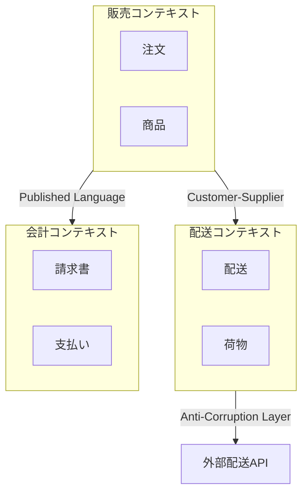

# 境界づけられたコンテキスト

DDD における戦略的設計の中核である境界づけられたコンテキストの分析・抽出と、コンテキストマップの mermaid 図生成を行う。

## 境界づけられたコンテキストとは

特定のドメインモデルが適用される明示的な境界である。同じ用語でもコンテキストが異なれば意味が変わる。

**判断基準:**
- ユビキタス言語が異なる領域 → 別コンテキスト
- 独立してデプロイ・変更できる単位 → 別コンテキスト
- 異なるドメインエキスパートが担当する領域 → 別コンテキスト
- 同一トランザクションで整合性が必要な領域 → 同一コンテキスト

## コンテキスト抽出プロセス

### Step 1: ドメイン知識の収集

対話的にドメインの全体像を把握する。以下の質問で情報を引き出す:

1. **このシステムの主要なビジネス機能は何か？**
2. **それぞれの機能を担当する部署・チームは？**
3. **同じ言葉が異なる意味で使われている場面はあるか？**
4. **独立して変更・デプロイしたい単位はどこか？**

### Step 2: コンテキスト候補の特定

収集した情報からコンテキスト候補を列挙する。

**判定ツリー:**

```
この機能群は同一コンテキストか？
├─ 同じユビキタス言語を使う           → 同一コンテキスト候補
├─ 異なるユビキタス言語を使う         → 別コンテキスト
├─ 異なるチームが担当する             → 別コンテキスト
├─ 独立したライフサイクルで変更される → 別コンテキスト
└─ 強い整合性が必要                   → 同一コンテキスト候補
```

### Step 3: コンテキスト間の関係を定義

コンテキスト間の関係パターンを特定する。

| パターン | 説明 | 適用場面 |
|---------|------|---------|
| **Partnership** | 2チームが協調して成功・失敗する | 密な協力関係がある場合 |
| **Shared Kernel** | 共有するモデルの一部を合意管理 | 小さな共有部分がある場合 |
| **Customer-Supplier** | 上流が下流の要求に対応する | 明確な依存方向がある場合 |
| **Conformist** | 下流が上流のモデルに従う | 上流を変更できない場合 |
| **Anti-Corruption Layer** | 変換層で外部モデルを隔離 | レガシーや外部システム連携 |
| **Open Host Service** | 公開プロトコルでサービス提供 | 多くの下流が接続する場合 |
| **Published Language** | 標準化された交換フォーマット | 広く共有されるデータ形式 |
| **Separate Ways** | 統合しない | 統合コストが価値を上回る場合 |

### Step 4: mermaid コンテキストマップの生成

分析結果を mermaid 図として出力する。`docs/context-map.md` に保存する。



## コンテキストマップの出力形式

生成するファイルには以下を含める:

1. **mermaid 図**: コンテキスト間の関係を視覚化
2. **コンテキスト一覧表**: 各コンテキストの責務・主要概念・チーム
3. **関係パターン表**: コンテキスト間の関係パターンと理由
4. **統合ポイント**: コンテキスト間のデータ交換方法

## 既存コードベースからの抽出

既存コードベースがある場合は、以下の手順でコンテキストを抽出する:

1. パッケージ/モジュール構造を走査し、ドメイン層の構成を把握する
2. 名前空間やディレクトリ名からコンテキスト候補を特定する
3. クラス間の依存関係を分析し、コンテキスト境界の妥当性を検証する
4. コンテキスト間の直接参照（境界違反）を検出する

## アンチパターン

- **Big Ball of Mud**: コンテキスト境界がなく全てが密結合 → 段階的に境界を引く
- **過度な分割**: 些細な違いで分割しすぎる → 統合コストと分割メリットを比較する
- **共有カーネルの肥大化**: 共有部分が大きくなりすぎる → ACL に切り替える

## 擬似コード例

`examples/` ディレクトリに具体例がある:
- **`examples/context-map.md`** — EC サイトのコンテキストマップ例
