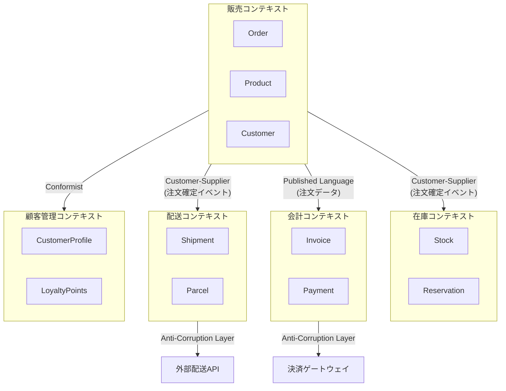

# コンテキストマップ — ECサイト例

## コンテキスト一覧

| コンテキスト | 責務 | 主要概念 |
|------------|------|---------|
| 販売 (Sales) | 商品の検索・注文管理 | Order, Product, Customer |
| 在庫 (Inventory) | 在庫の管理・引当 | Stock, Warehouse, Reservation |
| 配送 (Shipping) | 配送の手配・追跡 | Shipment, Parcel, Carrier |
| 会計 (Accounting) | 請求・決済・売上管理 | Invoice, Payment, Revenue |
| 顧客管理 (CRM) | 顧客情報・ロイヤルティ | CustomerProfile, LoyaltyPoints |

## コンテキストマップ (mermaid)

## コンテキスト間の関係

| 上流 | 下流 | パターン | 理由 |
|------|------|---------|------|
| 販売 | 在庫 | Customer-Supplier | 在庫チームは販売チームの要求に応える |
| 販売 | 配送 | Customer-Supplier | 配送チームは販売チームの要求に応える |
| 販売 | 会計 | Published Language | 標準化された注文データで連携 |
| CRM | 販売 | Conformist | 販売はCRMのモデルに従う |
| 配送 | 外部配送API | Anti-Corruption Layer | 外部APIの変更から保護 |
| 会計 | 決済GW | Anti-Corruption Layer | 外部APIの変更から保護 |

## 統合ポイント

| 連携 | 方式 | イベント/データ |
|------|------|---------------|
| 販売→在庫 | ドメインイベント | OrderPlaced → 在庫引当 |
| 販売→配送 | ドメインイベント | OrderConfirmed → 配送手配 |
| 販売→会計 | ドメインイベント | OrderConfirmed → 請求書生成 |
| 配送→販売 | ドメインイベント | ShipmentDelivered → 注文完了 |
| 会計→販売 | ドメインイベント | PaymentReceived → 注文確定 |
